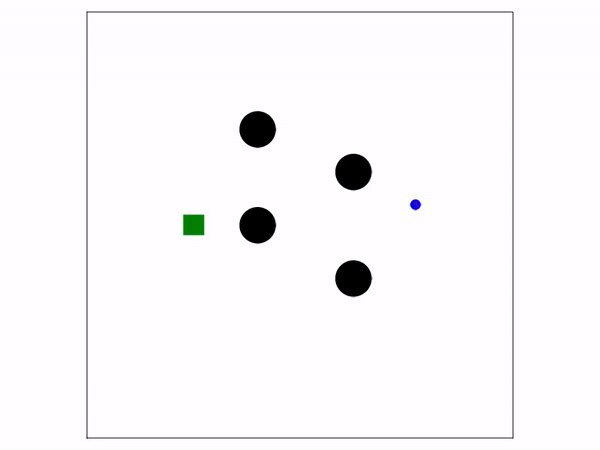
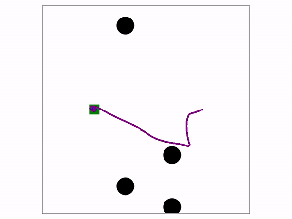
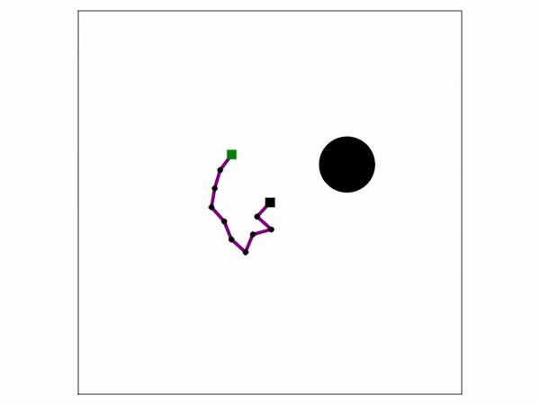
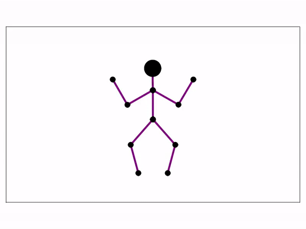

# Fabrics.jl


Julia implementation of [Geometric Fabrics for the Acceleration-based Design of Robotic Motion](https://arxiv.org/abs/2010.14750).

## Installation
1. Open your Julia REPL by typing  `julia` in your terminal.
2. Press `]` on your keyboard to enter the package manager
3. Enter command `add https://github.com/adubredu/Fabrics.jl"` and press 
`Enter` on your keyboard to install this package.
4. Press the `Backspace` key on your keyboard to return to the REPL

## Usage
I implement Geometric Fabrics for 3 Planar robot systems viz; A point mass, A planar robot arm and PickleRick, a planar humanoid robot.

Example usage scripts can be found in the [examples](examples) folder. 
To run an example as it is, go back to your Julia REPL, activate the environment where you installed this packagage and run the following commands:

```
using Fabrics
path = pathof(Fabrics)
include(joinpath(path, "examples/<example script filename>"))
```

To alter certain parameters of the dynamical system, you'll have to create a new Julia script, copy the specific example code and alter the parameters as you see fit. Note that before you run the Julia script, you should activate the Julia environment where you installed this package.

### Point Mass Navigator fabric
Here's an example script to run the Point Mass navigator fabric :

```julia
using Fabrics

x = [5.5, 0.0]
ẋ = [0.0, 0.0] 
O = [[-2.0, 0.0], [2.5, -2.5], [-2.0, 4.5], [2.5, 2.5]]
g = [-5.0, 0.0]
or = 1.75*ones(length(O))
r = 0.5

env = PointMass(x, ẋ, r, O, or, g)
env.show_tail = true
env.dynamic = false
env.obstacle_speed = 0.017 #17 mm/sec
ax, fig = visualize_system!(env)
horizon = 10000

for i=1:horizon
    global x, ẋ
    if env.dynamic move_obstacles!(env) end
    ẍ = pointmass_fabric_solve(x, ẋ, env)
    step!(ẍ, env)
    x = env.x
    ẋ = env.ẋ
    sleep(env.Δt/horizon)
end
```

You should see a Makie visualization below:



To make the obstacles dynamic, change the `env.dynamic` parameter to true as in this script below. I use different initial obstacle positions to make things interesting:

```julia
using Fabrics

x = [5.5, 0.0]
ẋ = [0.0, 0.0]
O = [[-2.0, 5.0], [2.5, -7.5], [-2.0, 9.5], [2.5, 7.5]] 
g = [-5.0, 0.0]
or = 1.75*ones(length(O))
r = 0.5

env = PointMass(x, ẋ, r, O, or, g)
env.show_tail = true
env.dynamic = true
env.obstacle_speed = 0.017 #17 mm/sec
ax, fig = visualize_system!(env)
horizon = 10000

for i=1:horizon
    global x, ẋ
    if env.dynamic move_obstacles!(env) end
    ẍ = pointmass_fabric_solve(x, ẋ, env)
    step!(ẍ, env)
    x = env.x
    ẋ = env.ẋ
    sleep(env.Δt/horizon)
end
```

You should see a Makie visualization below:



### 2-DOF Planar Arm Fabric
To run the 2 Dof Planar Arm example, go back to your Julia REPL, activate the environment where you installed this packagage and run the following commands:

```
using Fabrics
path = pathof(Fabrics)
include(joinpath(path, "examples/planararm_eg.jl"))
```

You should see the visualization below:


### 10-DOF Planar Arm Fabric
To run the 10 Dof Planar Arm example, go back to your Julia REPL, activate the environment where you installed this packagage and run the following commands:

```
using Fabrics
path = pathof(Fabrics)
include(joinpath(path, "examples/multiplanararm_eg.jl"))
```

You should see the visualization below:



### PickleRick Bullet-Dodging Fabric
To run the PickleRick Bullet-Dodging Fabric example, go back to your Julia- REPL, activate the environment where you installed this packagage and run the following commands:

```
using Fabrics
path = pathof(Fabrics)
include(joinpath(path, "examples/picklerick_eg.jl"))
```

You should see the visualization below:


